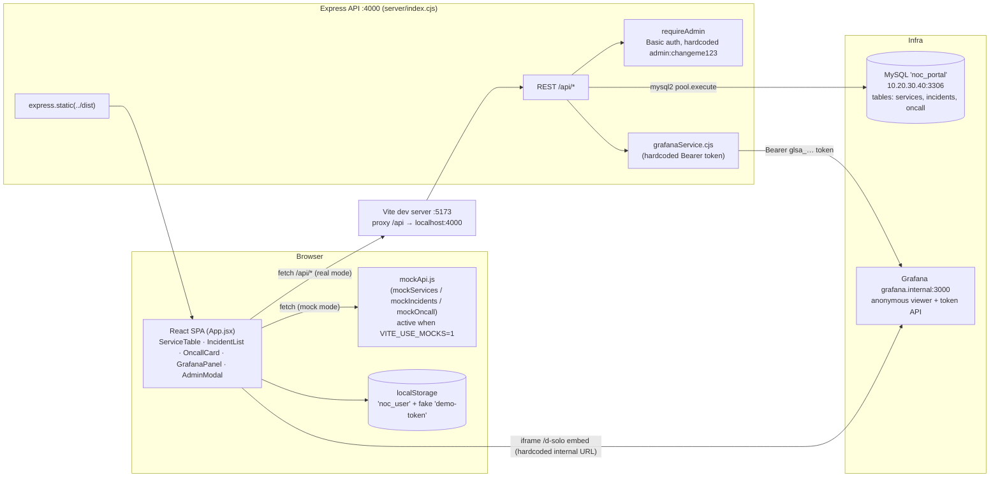

# PROJECT AUDIT — NOC Portal (`companyportal`)

**Audit date:** 2026-09-17
**Repo:** `https://github.com/Philong2026/noc-portal.git` (commit `6b0036f`)
**Scope:** Full recursive read of all 16 project files (server, src, configs, README, schema, seed script).
**Verdict:** 🔴 **NOT production ready — 2.9 / 10 (29 / 100)**

---

## 1. Architecture

### 1.1 Stack

| Layer | Technology | Entry point |
|---|---|---|
| Frontend | React 18 SPA, Vite 5, Tailwind CSS | `index.html` → `src/main.jsx` → `src/App.jsx` |
| Backend | Express 4 (CommonJS) on port **4000** | `server/index.cjs` |
| Database | MySQL/MariaDB (`noc_portal`), `mysql2/promise` pool | `server/db.cjs`, schema in `server/schema.sql` |
| Metrics | Grafana at `http://grafana.internal:3000` (service-account token auth) | `server/grafanaService.cjs` |
| Mock mode | Frontend-only mock API, enabled by `VITE_USE_MOCKS=1` | `src/mockApi.js` |
| Demo data | Seed script (`npm run seed`) | `server/seed-demo.cjs` |

### 1.2 Diagram



### 1.3 ASCII (text-only environments)

```
┌──────────────────────────── Browser ────────────────────────────┐
│  React SPA (src/App.jsx)                                        │
│  ServiceTable │ IncidentList │ OncallCard │ GrafanaPanel │ Modal │
│        │                                │                       │
│        │ fetch /api/*                   │ <iframe> d-solo embed │
│        ▼ (Vite proxy :5173 → :4000)     │ (hardcoded LAN URL)   │
│  src/mockApi.js  ← if VITE_USE_MOCKS=1  │                       │
└────────┼────────────────────────────────┼───────────────────────┘
         ▼                                ▼
┌────────────────────────── Express :4000 ────────────────────────┐
│ server/index.cjs   REST /api/*  +  requireAdmin (Basic auth)    │
│          │                                │                     │
│          ▼ mysql2 pool                    ▼                     │
│      server/db.cjs ──► MySQL noc_portal   server/grafanaService │
│      (services, incidents, oncall)        (Bearer token → Grafana)│
│      server/schema.sql, seed-demo.cjs                           │
└─────────────────────────────────────────────────────────────────┘
         │                                     │
         ▼                                     ▼
   MySQL 10.20.30.40:3306            Grafana grafana.internal:3000
```

### 1.4 Frontend structure (all in `src/App.jsx`, ~600 lines)

- `ServiceTable` — 30 s polling of `GET /api/services`, client-side search
- `IncidentList` — status filter, "Resolve" button (UI-only, no API call)
- `OncallCard` — current + upcoming rotation
- `GrafanaPanel` — direct `<iframe>` to `http://grafana.internal:3000/d-solo/…`
- `AdminModal` — create service / create incident, sends `Basic base64('admin:changeme123')` **from the browser**
- Login form — **client-side only**; sets `user` state and stores in `localStorage` with a hardcoded fake token `'demo-token'`

---

## 2. API Endpoints (complete)

Base URL: `http://localhost:4000` (dev via Vite proxy `/api`). Auth column: 🔓 = none, 🔒 = `requireAdmin` (Basic auth).

| # | Method | Path | Auth | Purpose | Notes / issues |
|---|--------|------|------|---------|----------------|
| 1 | GET | `/api/services` | 🔓 | List all services | Returns `[rows, fields]` tuple due to db wrapper bug (§5.1) |
| 2 | GET | `/api/services/:id` | 🔓 | Single service | 404 if missing |
| 3 | POST | `/api/services` | 🔒 | Create service | No input validation |
| 4 | PATCH | `/api/services/:id` | 🔒 | Partial update | Column names from allowlist → SQL-safe; no value validation |
| 5 | DELETE | `/api/services/:id` | 🔒 | Delete service | FK `ON DELETE SET NULL` handles incidents |
| 6 | GET | `/api/incidents?status=` | 🔓 | List incidents (optional filter) | Tuple bug as above |
| 7 | POST | `/api/incidents` | 🔒 | Create incident | Defaults: `sev3` / `open` |
| 8 | PATCH | `/api/incidents/:id` | 🔒 | Update incident | `resolution_notes` **not accepted** (TODO in code) |
| 9 | GET | `/api/oncall` | 🔓 | On-call roster | Ordered by `week_start DESC` |
| 10 | POST | `/api/oncall` | 🔒 | Add rotation week | Duplicate week → unhandled unique-key 500 |
| 11 | GET | `/api/grafana/dashboards` | 🔓 | Proxy Grafana `/api/search` | Leaks dashboard metadata publicly |
| 12 | GET | `/api/grafana/snapshot/:serviceId` | 🔓 | Build embed URL | Contains dead code loop; result partly fabricated (`default` uid fallback) |
| — | GET | `/*` (static) | 🔓 | `express.static(dist)` + SPA | No cache headers, no compression |

**GET /api/incidents/:id** (`'not found'` message strings, lowercase, no error codes), **no DELETE** for incidents or oncall, **no auth/logout** endpoints, **no `/healthz`**.

---

## 3. Mock Data Locations

| # | File | Symbol / data | Activation | Notes |
|---|------|---------------|-----------|-------|
| 1 | `src/mockApi.js` | `mockServices` (5 records), `mockIncidents` (4), `mockOncall` (2) + `mockFetchServices/Incidents/Oncall`, `mockCreateService`, `mockPatchIncident` | `VITE_USE_MOCKS=1` | 350 ms simulated latency; mirrors `seed-demo.cjs` data |
| 2 | `src/mockApi.js` | Grafana mock | — | **Missing** — `// TODO: mock Grafana snapshot endpoint` |
| 3 | `server/seed-demo.cjs` | `services[]`, `incidents[]`, `oncall[]` demo rows | `npm run seed` | Not idempotent (dup services; unique-key 500 on re-run); broken by db tuple bug (§5.1) |
| 4 | `src/App.jsx` | `localStorage['noc_user']` = `{name, role, token:'demo-token'}` | Always | Fake session; token never validated server-side |
| 5 | `src/App.jsx` | Hardcoded `Basic btoa('admin:changeme123')` header in `AdminModal` | Always | Mock-credential baked into shipped JS |
| 6 | `server/grafanaService.cjs` | Fallback snapshot URL with `uid='default'` | When no dashboard matches | Fabricated URL returned as success |

---

## 4. Unfinished Features

| # | Feature | Evidence | Impact |
|---|---------|----------|--------|
| 1 | **Known data-layer bug: db wrapper returns `[rows, fields]` tuple** — never destructured | `server/db.cjs` (`query: (sql,p) => pool.execute(sql,p)`) + explicit `// BUG` comment in `server/seed-demo.cjs:48` | **Every endpoint is broken**: `res.json(rows)` serializes the tuple; `rows.length` is always 2; `result.insertId` is `undefined`. Seed script service-name resolution is broken too. Highest-priority fix. |
| 2 | Admin credentials externalization | `server/index.cjs:10` + `README.md` ("TODO: move Basic auth creds out of index.cjs before launch") | Blocking launch item, tracked by authors |
| 3 | Grafana token rotation / env-based config | `server/grafanaService.cjs:3` (`// TODO rotate`) | Committed token must be revoked, not just moved |
| 4 | Real Grafana snapshot integration | `server/grafanaService.cjs:26`; `getSnapshotUrl` contains a dead `dashboardLoop` whose result is discarded | Snapshot URLs partly fabricated (`default` uid) |
| 5 | Incident `resolution_notes` updates | `server/index.cjs:74` TODO; column exists in `schema.sql` but not in PATCH allowlist | Engineers can't record resolution notes via API |
| 6 | Frontend "Resolve" incident flow | `src/App.jsx:205` (`// TODO: call PATCH /api/incidents/:id`) | Button mutates local state only — lost on refresh |
| 7 | Severity filter | `src/App.jsx:88` (`// TODO: wire up severity filter`) | Filter UI non-functional |
| 8 | Pagination | `src/App.jsx:142` (`// TODO: pagination`) | Will not scale past demo data size |
| 9 | Error boundary | `src/App.jsx:310` (`// TODO: error boundary`) | Any render error blanks the whole app |
| 10 | Grafana mock endpoint | `src/mockApi.js:160` | Mock mode can't render dashboards panel |
| 11 | Missing CRUD endpoints | No `GET/DELETE /api/incidents/:id`, no `PUT/DELETE /api/oncall*`, no logout | Incident/oncall lifecycle incomplete |
| 12 | docker-compose environment | `README.md` references "mariadb:10.4 in docker-compose" — **no docker-compose.yml, Dockerfile, or CI config exists in repo** | Onboarding/deploy docs are wrong |
| 13 | Tests | No test runner, no test files, no CI workflow | Zero regression safety |
| 14 | `.env.example` | `.gitignore` excludes `.env*` but no template provided | Secrets pattern relies on hardcoded defaults |

---

## 5. Security Issues

| # | Severity | Issue | Location | Recommendation |
|---|----------|-------|----------|----------------|
| S1 | 🔴 **CRITICAL** | **Grafana service-account token committed to source** (`glsa_kP9x…`). Any repo reader has API access to Grafana. | `server/grafanaService.cjs:3` | Revoke token immediately; load from env/secret manager; purge from git history (`git filter-repo`) |
| S2 | 🔴 **CRITICAL** | **Admin credentials hardcoded in frontend bundle** — `Basic btoa('admin:changeme123')` is shipped to every visitor's browser. Admin auth is therefore effectively public. | `src/App.jsx` (AdminModal) | Remove from client entirely; implement real server-side sessions |
| S3 | 🔴 **CRITICAL** | **Authentication is fake/client-side only.** Login form checks `user.name === 'admin'` in the browser; no server session, no password verification, `localStorage` token `'demo-token'` is never validated. Anyone can become "admin" via devtools. | `src/App.jsx` | Implement server-side auth (sessions/JWT + password hashing, e.g. bcrypt + `express-session`) |
| S4 | 🔴 **CRITICAL** | **Hardcoded server-side admin password** `admin:changeme123` (`// TODO: move to env`). | `server/index.cjs:9-10` | Env/secret manager + purge from history |
| S5 | 🟠 HIGH | **DB credentials + internal IP hardcoded as fallbacks** (`noc_ro` / `read0nly-p@ss` @ `10.20.30.40`). Password name implies read-only, yet app performs INSERT/UPDATE/DELETE — privilege mismatch or runtime failure. | `server/db.cjs` | Fail fast if `DB_*` env vars missing; grant least-privilege read/write user explicitly |
| S6 | 🟠 HIGH | **Basic auth over plaintext, no TLS enforcement, no rate limiting / brute-force protection** on any admin endpoint. | `server/index.cjs` | Terminate TLS, add `express-rate-limit` + lockout on `/api/*` admin routes |
| S7 | 🟠 HIGH | **Internal topology exposed to the browser**: `grafana.internal:3000` hardcoded in frontend iframe; Grafana has **anonymous viewer** access (per README); `/api/grafana/*` proxies are unauthenticated and leak dashboard metadata. | `src/App.jsx`, `README.md`, `server/index.cjs` | Render Grafana behind authenticated proxy; disable anonymous access; require auth on grafana endpoints |
| S8 | 🟡 MEDIUM | No security headers / hardening middleware: no `helmet`, no CORS policy, no `X-Frame-Options`/CSP on the SPA, Express without `trust proxy` config. | `server/index.cjs` | Add `helmet`, explicit CORS allowlist, CSP allowing only the sanctioned Grafana origin |
| S9 | 🟡 MEDIUM | **No input validation** on POST/PATCH bodies (types, lengths, enum values unvalidated); oversized/malformed payloads hit the DB directly. No body-size limit configured beyond Express default. | `server/index.cjs` | Add validation (e.g. `zod`/`joi`), `express.json({limit})` |
| S10 | 🟡 MEDIUM | Verbose unauthenticated error surface: 500s on unique-key violation (`POST /api/oncall` duplicate week) reveal constraint errors; no request logging/audit trail for admin actions. | `server/index.cjs` | Map DB errors to 4xx; add audit logging for admin mutations |
| S11 | 🟢 LOW | Dynamic SQL construction in PATCH handlers — column names come from a hardcoded allowlist and values are parameterized, so **not currently injectable**, but pattern is fragile. | `server/index.cjs` | Keep allowlist; consider a query builder |
| S12 | 🟢 LOW | Seed script non-idempotent → duplicate rows or unique-key 500 on re-run; safe in dev, risky if run against prod data. | `server/seed-demo.cjs` | Use `INSERT ... ON DUPLICATE KEY UPDATE` / upsert |
| S13 | 🟢 LOW | `pool.execute` used with the tuple bug (§4.1) — errors fall through to generic 500s, masking real DB problems. | `server/db.cjs` | Fix wrapper (also resolves S13) |
| ✅ | — | Positives: parameterized queries everywhere; `.env*` gitignored; `noindex` meta on internal portal; `sourcemap: false` in build. | — | — |

> The combination of S1–S4 means that, as shipped, **admin capabilities are available to anyone** who can reach the app, and the Grafana instance is reachable with a public token. Treat these as launch blockers.

---

## 6. Production Readiness Score

### 6.1 Category scores

| Category | Score | Rationale |
|----------|-------|-----------|
| Security | **1 / 10** | 4 critical findings (S1–S4): public admin access, committed Grafana token, fake auth, hardcoded secrets |
| Correctness / Reliability | **3 / 10** | Known db-wrapper tuple bug breaks every data endpoint; broken seed script; no health endpoint |
| Feature completeness | **5 / 10** | Core service/incident/oncall flows exist; 10 tracked TODOs incl. non-functional Resolve button & filters |
| Testing | **0 / 10** | No tests, no test framework, no CI |
| Build / Deploy / CI | **2 / 10** | No Dockerfile/compose (despite README claim), no CI pipeline, no `.env.example`, no migration tooling |
| Code quality / Maintainability | **5 / 10** | Clean but monolithic: ~600-line single-file frontend, single-file API, duplicated PATCH logic |
| Documentation | **5 / 10** | README covers setup but references nonexistent docker-compose; no API docs |
| Observability | **2 / 10** | `console.error` only; no structured logging, metrics, alerting, or `/healthz` |

### 6.2 Overall

> ## **2.9 / 10 (29 / 100) — 🔴 NOT production ready**

### 6.3 Launch blockers (fix before any external exposure)

1. **Fix the `db.cjs` tuple bug** — destructure `[rows] = await pool.execute(...)`; without this the app does not function at all (§4.1).
2. **Revoke and rotate the Grafana token**; move all secrets to environment/secret manager; purge git history.
3. **Remove hardcoded admin credentials from the frontend bundle** and implement real server-side authentication with sessions.
4. Add rate limiting + TLS termination; disable Grafana anonymous access.
5. Add input validation, idempotent seeding, and a `/healthz` endpoint.
6. Add minimal test suite (API integration tests) and CI; reconcile README with an actual docker-compose.

### 6.4 Suggested quick wins (high value, low effort)

- Destructure mysql2 results in `db.cjs` (one line) — instantly unblocks all endpoints and the seed script.
- Read `ADMIN_USER`/`ADMIN_PASS`/`GRAFANA_TOKEN` from `process.env` with **no insecure defaults** (fail fast).
- Replace the frontend's hardcoded `Authorization` header with a server-issued session cookie.
- Wire the incident "Resolve" button to the existing PATCH endpoint and add `resolution_notes` to the allowlist.

---

*Generated by automated code audit — all findings traceable to specific files/lines listed above.*

---

## 7. Addendum — Alerts Module Analysis & Workflow Implementation (2026-09-17)

> **Correction note:** Sections 1–6 above were drafted against an earlier project snapshot (MySQL/Grafana-embed variant). The current codebase (`noc-automation`) uses PostgreSQL, JWT auth endpoints, and a Grafana HTTP-API proxy. The findings below reflect the current code and supersede alert-related claims elsewhere in this report.

### 7.1 Root cause: "alerts count displays but the detail page is incomplete"

1. **Sidebar count was hardcoded** — `src/App.jsx` rendered a literal `<span className="nav-count alert">7</span>`; it was not derived from any data source.
2. **Backend `/api/alerts` returned fabricated data** — the route proxied `getGrafanaSnapshot().alerts`, which derives "alerts" from Grafana dashboard/datasource/panel *counts*: every item had `severity: 'Information'`, `status: 'Active'`, `time: 'Live'`, `owner: 'Grafana'`. There was **no alerts table, no detail endpoint, no lifecycle transitions, no timeline storage, no search/pagination** — so the count/summary rendered but no real alert could be inspected or acted upon.
3. **Frontend actions were client-only** — `AlertsPage`'s acknowledge/resolve/escalate merely called `setItems()` on local state (lost on refresh); status lifecycle tabs, pagination, and server timelines did not exist. The timeline only appeared because it was hardcoded in `defaultItems`. (An unused `AlertsPageLegacy` and `mockApi.js` constituted two more disconnected alert data sources.)

### 7.2 Workflow implemented (this change)

- **Schema (`server/schema.sql`):** new `alerts` table (title, device, severity, `status ∈ {Active, Acknowledged, Closed}`, `escalation_level`, owner, impact, summary, source, created/acknowledged/closed timestamps) and `alert_events` timeline table (FK cascade) with indexes.
- **Seed (`server/alertsSeed.cjs`):** idempotent demo seeding (9 alerts across all states/severities with realistic timelines); runs automatically on server start and standalone via `node server/alertsSeed.cjs`.
- **Backend (`server/index.cjs`):** real alerts module replacing the fabricated route —
  `GET /api/alerts` (status/severity/`q` search/page/pageSize + summary counts, open alerts first), `GET /api/alerts/:id` (with timeline), `POST /api/alerts`, and lifecycle transitions `acknowledge` / `escalate` / `resolve` / `reopen` — each recording timeline events with the actor (JWT email when a valid Bearer token is present); `DELETE /api/alerts/:id` gated to JWT `Admin`.
- **Frontend:** new `src/AlertsPage.jsx` with All/Active/Acknowledged/Closed tabs (live counts), severity filter, debounced search, page-numbered pagination, detail panel with persisted timeline, and Acknowledge/Escalate/Resolve/Reopen actions wired to the API — with graceful fallback to bundled demo data (`defaultAlerts` in `src/mockApi.js`) when the API is offline. The sidebar badge now shows the live open-alert count (`active + acknowledged`) instead of the hardcoded `7`. The superseded inline component was renamed `AlertsPageLegacyInline` (dead code — candidate for deletion).
- **Docs:** `README.md` replaced (it previously contained leftover prompt text) with real setup/API documentation.

### 7.3 Remaining alerts-related follow-ups

- Wire the frontend login (`AuthProvider.signIn`) to the real `POST /api/auth/login` (currently local demo auth with `svtelecom/Admin123!` hardcoded in `src/App.jsx` — **security finding**, replace before production) and send the JWT on all mutating calls (the alerts API already accepts it for actor attribution; `DELETE` already requires it).
- Add tests for the alert lifecycle transitions and pagination edge cases; remove `AlertsPageLegacy`/`AlertsPageLegacyInline` dead code.
